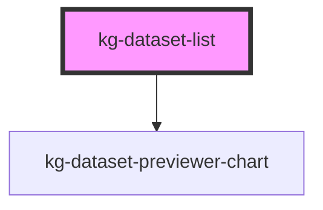

# kg-dataset-list


<!-- Auto Generated Below -->


## Properties

| Property             | Attribute                   | Description | Type     | Default                            |
| -------------------- | --------------------------- | ----------- | -------- | ---------------------------------- |
| `backendUrl`         | `kg-ds-prv-backend-url`     |             | `string` | `KG_DATASET_PREVIEWER_BACKEND_URL` |
| `containerClass`     | `kg-ds-prv-container-class` |             | `string` | ````                               |
| `filterCriteriaProp` | `kg-ds-prv-filter-criteria` |             | `string` | `undefined`                        |
| `itemClass`          | `kg-ds-prv-item-class`      |             | `string` | `''`                               |
| `kgId`               | `kg-ds-prv-kg-id`           |             | `string` | `undefined`                        |
| `kgSchema`           | `kg-ds-prv-kg-schema`       |             | `string` | ``minds/core/dataset/v1.0.0``      |


## Events

| Event            | Description | Type               |
| ---------------- | ----------- | ------------------ |
| `kgDsPrvUpdated` |             | `CustomEvent<any>` |


## Methods

### `getDatasetFiles() => Promise<IDatasetFile[]>`


#### Returns

Type: `Promise<IDatasetFile[]>`


## Dependencies

### Depends on

- [kg-dataset-previewer-chart](../kg-dataset-previewer-charts)

### Graph


----------------------------------------------

*Built with [StencilJS](https://stenciljs.com/)*
