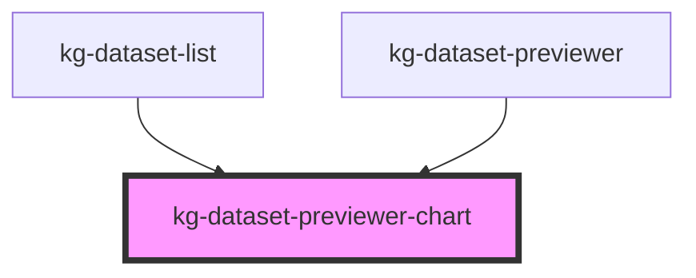

# kg-dataset-previewer-chart

<!-- Auto Generated Below -->

## Properties

| Property   | Attribute                | Description | Type      | Default     |
| ---------- | ------------------------ | ----------- | --------- | ----------- |
| `darkmode` | `kg-ds-prv-darkmode`     |             | `boolean` | `false`     |
| `dataProp` | `kg-ds-prv-chartjs-data` |             | `string`  | `undefined` |

## Events

| Event            | Description | Type               |
| ---------------- | ----------- | ------------------ |
| `kgDsPrvUpdated` |             | `CustomEvent<any>` |

## Methods

### `getHrefUrl() => Promise<unknown>`

#### Returns

Type: `Promise<unknown>`

## Dependencies

### Used by

 - [kg-dataset-list](../kg-dataset-list)
 - [kg-dataset-previewer](../kg-dataset-previewer)

### Graph

----------------------------------------------

*Built with [StencilJS](https://stenciljs.com/)*
