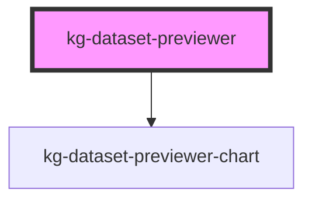

# my-component

<!-- Auto Generated Below -->

## Properties

| Property     | Attribute               | Description | Type     | Default                            |
| ------------ | ----------------------- | ----------- | -------- | ---------------------------------- |
| `backendUrl` | `kg-ds-prv-backend-url` |             | `string` | `KG_DATASET_PREVIEWER_BACKEND_URL` |
| `filename`   | `kg-ds-prv-filename`    |             | `string` | `undefined`                        |
| `kgId`       | `kg-ds-prv-kg-id`       |             | `string` | `undefined`                        |
| `kgSchema`   | `kg-ds-prv-kg-schema`   |             | `string` | ``minds/core/dataset/v1.0.0``      |

## Dependencies

### Depends on

- [kg-dataset-previewer-chart](../kg-dataset-previewer-charts)

### Graph

----------------------------------------------

*Built with [StencilJS](https://stenciljs.com/)*
