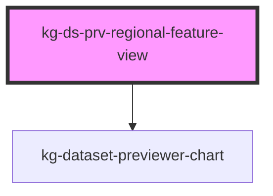

# kg-ds-prv-regional-feature-view

<!-- Auto Generated Below -->

## Properties

| Property       | Attribute               | Description | Type      | Default                            |
| -------------- | ----------------------- | ----------- | --------- | ---------------------------------- |
| `backendUrl`   | `kg-ds-prv-backend-url` |             | `string`  | `KG_DATASET_PREVIEWER_BACKEND_URL` |
| `darkmode`     | `kg-ds-prv-darkmode`    |             | `boolean` | `false`                            |
| `filename`     | `kg-ds-prv-filename`    |             | `string`  | `undefined`                        |
| `injectedData` | `kg-ds-prv-data`        |             | `any`     | `undefined`                        |
| `kgId`         | `kg-ds-prv-kg-id`       |             | `string`  | `undefined`                        |
| `kgSchema`     | `kg-ds-prv-kg-schema`   |             | `string`  | ``minds/core/dataset/v1.0.0``      |

## Events

| Event                                  | Description | Type               |
| -------------------------------------- | ----------- | ------------------ |
| `kg-ds-prv-regional-feature-mouseover` |             | `CustomEvent<any>` |

## Dependencies

### Depends on

- [kg-dataset-previewer-chart](../kg-dataset-previewer-charts)

### Graph

----------------------------------------------

*Built with [StencilJS](https://stenciljs.com/)*
